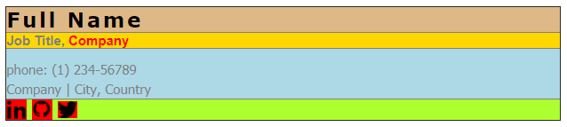
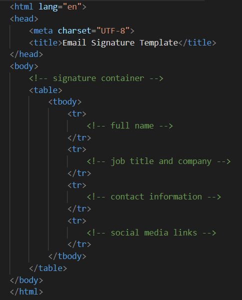
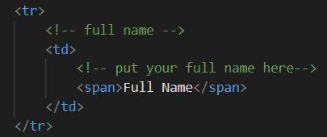
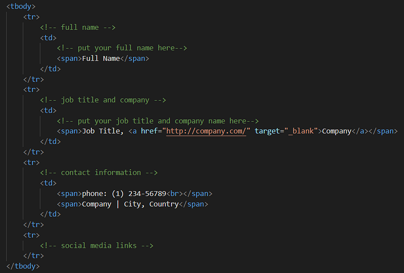
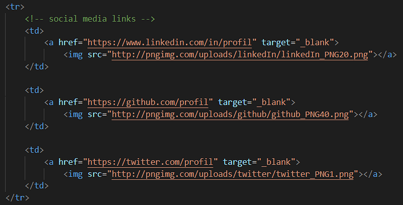
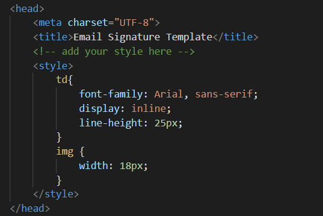
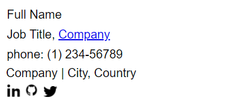
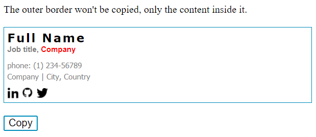

So, you got bored of the classic email signature you keep sending to your co-workers? You have probably searched for some inspiring signatures in Pinterest and you found some. Still, you couldn't mimic them in your email client as it provides you with a limited text editor with few customization options.

**If you are exactly in this situation, this post will help you code your own email signature.**

You won't need much to make the perfect signature, all you will need is:

- some basic understanding of HTML and CSS,
- email client, *obviously* (Gmail, Outlook, Thunderbird or any other client),
- finally, some inspiration and creativity ‍🎨.

## How are we building our own email signature?

I opted for using HTML and CSS as they give more freedom in styling your content without sticking to limited options like font style and font size. Still, each email client can handle the content of your signature differently, so you should better play with the most basic components in HTML. For the following examples, I will be using `div`, `img` and `table` elements.

The plan is to create an HTML file, fill it with code that will generate the perfect email signature, then move it to our email client.
*As simple as it sounds* ✌🏻.

## Prepare the overall structure of your signature

After filling my day's history with searches in Pinterest and Google Images. I made my mind and I chose the following structure as my future email signature. Not that stylish but it shows clearly all the required information.


Jumping directly into your text editor to mimic this design is not the recommended way I would suggest. Instead, we should analyse the overall structure of the picture, determine what are the big pieces used to get this layout, then build each component step by step. You know… baby steps.

So, the layout I can quickly notice being used in this design is the table layout:

- each line in the picture is a row in the table (or `tr` in HTML)
- each line has its own text with some specific style
- last line contains multiple columns (or `td` in HTML)
- each column in last line contains a hyperlink and an image.

We can easily highlight all the described components as follows:



## Build your email signature

Now that we have an overall idea on the structure of our email signature, let's start building the HTML representation of that structure.

First, we will start with a global skeleton which we will improve step by step.



As the comments show in the HTML code, each `tr` element will contain additional HTML elements which should produce the design we want.

We will start with main section which shows your full name, inside its correspondant `tr` element, we will add a single column `td` with a `span` containing a simple text.



Easy, isn't it? Just like the previous operation, we will add sample code for the other sections: job title, company and contact information.



Remember how we described the layout for the social media links; they are multiple columns inside a single row, each column contains a link and a picture. That being said, we will need additional HTML elements: `a` and `img`.



## Add style and customization

You can now open your final HTML page in your favorite browser and embrace your new email signature …


Something is wrong? Indeed, your HTML page has valid structure, but lacks good representation that fits your needs. Therefore, we will need to add some custom CSS code.

In your HTML page, specifically in the `head` element, you will need to add the `style` element and fill it with your magic recipe.



The previous simple style should at least produce some readable content:



We're almost done with building our email signature, you can go ahead and play with HTML and CSS until you get the desired layout that suits you.

I improved the last example to produce the exact design we analyzed previously and added a cool simple feature. Let's take a look at the code first (also available as a [gist](https://gist.github.com/tahabasri/5015e300f3b49f40e52a55b30716ae2a)):

```html
<html lang="en">

<head>
    <meta charset="UTF-8">
    <meta name="viewport" content="width=device-width, initial-scale=1.0">
    <title>Email Signature Template</title>
    <style>
        .container-border {
            border: 1px solid #008CBA;
            padding: 1%;
        }

        .container {
            width: 500px;
            font-family: Verdana, sans-serif;
            font-size: 10pt;
            border-spacing: 0;
            border-collapse: collapse;
        }

        .name-container {
            width: 100%;
            display: inline;
            vertical-align: top;
        }

        .name {
            font-size: 14pt;
            font-family: Verdana, sans-serif;
            font-weight: bold;
            color: #000000;
            letter-spacing: 2px;
        }

        .company-link {
            text-decoration: none;
            color: #FF0000;
        }

        .job-container {
            vertical-align: top;
        }

        .job {
            font-size: 9pt;
            font-family: Arial, sans-serif;
            font-weight: bold;
            color: #7F7F7F;
        }

        .contacts-container {
            line-height: 18px;
            padding-top: 10px;
            vertical-align: top;
        }

        .contacts {
            font-size: 9pt;
            font-family: Tahoma, sans-serif;
            color: #7F7F7F;
        }

        .social-network {
            display: inline-block;
            text-align: center;
            margin-right: 5px;
            margin-top: 8px;
        }

        .social-network-picture {
            width: 18px;
        }

        .button {
            background-color: #4CAF50;
            border: none;
            color: white;
            text-align: center;
            text-decoration: none;
            display: inline-block;
            font-size: 16px;
            margin: 20px 0px;
            transition-duration: 0.3s;
            cursor: pointer;
            background-color: white;
            color: black;
            border: 2px solid #008CBA;
        }

        .button:hover {
            background-color: #008CBA;
            color: white;
        }
    </style>
</head>

<body>
    <div>The outer border won't be copied, only the content inside it.</div>
    <br/>
    <div class="container-border">
        <table id="signature" class="container" cellpadding="0" cellspacing="0">
            <tbody>
                <tr>
                    <td class="name-container" valign="top">
                        <!-- put your full name here-->
                        <span class="name">Full Name</span>
                    </td>
                </tr>
                <tr>
                    <td class="job-container" valign="top">
                        <!-- put your job title and company name here-->
                        <span class="job">Job title, <a class="company-link"
                                href="http://company.com/" target="_blank">Company</a></span>
                    </td>
                </tr>
                <tr>
                        <!-- put your contact information here-->
                    <td class="contacts-container" valign="top">
                        <span class="contacts">phone: (1) 234-56789<br></span>
                        <span class="contacts">Company | City, Country</span>
                    </td>
                </tr>
                <tr>
                    <td>
                        <table cellpadding="0" cellspacing="0">
                            <tbody>
                                <!-- put your social network profiles here -->
                                <!-- pictures are retrieved from http://pngimg.com/ -->
                                <tr>
                                    <td class="social-network">
                                        <a href="https://www.linkedin.com/in/profil" target="_blank">
                                            </a>
                                    </td>

                                    <td class="social-network">
                                        <a href="https://github.com/profil" target="_blank">
                                            </a>
                                    </td>

                                    <td class="social-network">
                                        <a href="https://twitter.com/profil" target="_blank">
                                            </a>
                                    </td>
                                </tr>
                            </tbody>
                        </table>
                    </td>
                </tr>
            </tbody>
        </table>
    </div>

    <div>
        <!-- The button used to copy the content of the table element -->
        <button class="button" onclick="copyToClipboard()">Copy</button>
    </div>
</body>
<script>
    /**
        see https://stackoverflow.com/questions/2044616/select-a-complete-table-with-javascript-to-be-copied-to-clipboard
    **/
    function copyToClipboard() {
        var el = document.getElementById('signature');
        var body = document.body, range, sel;
        if (document.createRange && window.getSelection) {
            range = document.createRange();
            sel = window.getSelection();
            sel.removeAllRanges();
            try {
                range.selectNodeContents(el);
                sel.addRange(range);
            } catch (e) {
                range.selectNode(el);
                sel.addRange(range);
            }
            document.execCommand("copy");
            // clear selection
            if (sel) {
                if (sel.removeAllRanges) {
                    sel.removeAllRanges();
                } else if (sel.empty) {
                    sel.empty();
                }
            }
        } else if (body.createTextRange) {
            range = body.createTextRange();
            range.moveToElementText(el);
            range.select();
            range.execCommand("Copy");
        }
    }

</script>

</html>
```

This should generates the following output:



This is like a mini UI for previewing your email signature with an additional button to copy your email signature (that's the cool feature in case you're still wondering 🤯).

> The **Copy** button uses JavaScript to select everything inside the box and copy it to your clipboard. It is an additional feature and it is not mandatory for the purpose of this post.

## Add your email signature to your email client

We are finally in the most exciting part 👏. You have already opened your HTML page in your browser, here are the steps you will need in order to add your email signature in your future emails:

- copy the content of your HTML page (manually or using the magical button we introduced previously)
- open your email client and head towards the signature settings, its location may vary depending on which email client you have, you can always Google it 🔍.
- usually, your email client will provide you with a small text editor where you can compose your signature. All you have to do now is paste the content of your HTML signature. *Et voilà* 💪🏼 *!*

## Maintain your email signature

Now that you have a super duper email signature, you would want to save it somewhere for future maintenance in case of job promotion or contact information update (can't say if you may need to change your name 🤷‍♂️).

One of the places I would suggest is [Github](https://github.com/). If you have one file like mine, use the [Gist feature](https://gist.github.com/). But, if you're an advanced web design ninja and you may need multiple files, then go ahead and [create a New Repository](https://github.com/new) dedicated to your email signature.
