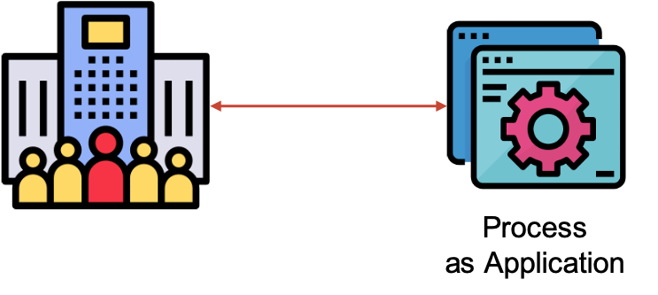
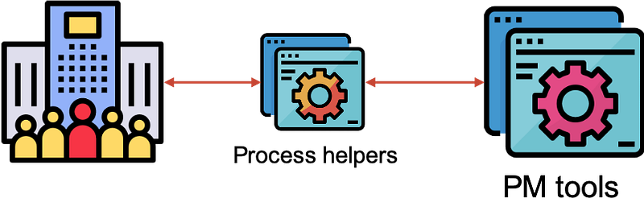

> This post is one of two parts article, this post does not require a strong technical background as it only explains the fundamentals of process management and the idea behind Process as Code.

Enterprises nowadays opt for various tools and technologies in order to facilitate their daily work.

As team size grows and tasks complexity rises, improving the usability of these tools and coordinating between them becomes more and more challenging.

Fortunately, Process as Code can help overcome those challenges.

## What is a process?

Because you're here for more interesting content than defining a process, we could say that a process is a collection of tasks that achieves a specific result.

Here is a silly example for anyone who's interested in learning how to tie a tie coincidentally while reading a technical article.

If you weren't able to make this kind of tie even after following the steps above (which is sad), you did already -unconsciously- follow the steps described, determining automatically the first step, the next one, each move needed and the final result. The whole process was well described in a single picture.

## What is Process Management?

*Side note: We will not go into the details of process management since many great articles here on Medium define in details this concept.*

The key idea we will need to understand is that Process Management as general as it is, is a practice that manages standard operational procedures to achieve a specific goal.

If you think that this definition is the same as the one for a process, then bear with me; Process management is generally used in business context. Anything that requires a set of steps can be named a process, but not all the processes require a practice for managing them.

Think of it like this, taking a shower is a process that requires few steps, but it is not that kind of process that requires a management.

Following this practice (Process management), we can optimize a set of tasks we routinely do by:

- Defining the steps required to achieve our main goal in order to reduce ambiguity and guesswork.
- Organizing these steps in order to clearly map the primary, less important and optional steps, this will help optimize the process by tweaking the tasks depending on the efficiency, time to execute and profitability.
- Standardizing our workflow using common tools and notations, this could and should improve quality and boost productivity.

## Process management inside your company

Each enterprise has a set of processes done by its teams in order to accomplish a certain task. For any field of activity, you will always find yourself doing some tasks that correspond to a specific process well named, defined and respected inside your organization.

Let's say you have to manage a process having a dozen of steps, which is very small number I introduced, given that there are processes with dozen**s** of steps. How can you optimize it?

First, you need to have a well defined process, this implies that you should have a **well documented process** in the first place. Having a good documentation for your process helps with clarifying what are the steps to do and reduce *heroic actions* when having no clue about what to do in a certain situation.

Secondly, your team should **follow the process**, respecting all the steps following the given order of their execution will improve productivity while reducing risks.

Lastly, you can integrate tools to **automate your process**. Many tools nowadays can help executing specific actions by themselves and they require only initial configuration, these tools can significantly reduce the workload letting team members focus on more meaningful tasks.

Always remember that an **optimized process** is one that given to a new employee, he can, with autonomy, follow each step described within this process until he completes it.

## Benefits of Process Management

There are many benefits you may gain opting for process management as a daily practice inside your organization. Here are the top ones I highlight:

1. **Agility**: because your organization can face changes regularly, your process is flexible in a way that you can easily make changes with minimal costs.
2. **Transparency**: the visibility of your process is crucial when it comes to being compliant with industry regulations, having a visible process helps with detecting problems and applying requirements quickly.
3. **Efficiency**: as we previously stated, well-designed processes helps reduce workload which improves productivity.
4. **Reduced risks**: because your process is well define, structured and adapted to your needs, you can reduce significantly risks.
5. **Technology integration**: using standard notations in combination with process management tools, your process can be automated and maintained with less effort.

## Is your process fully optimized?

Here comes the funny part, despite all the advantages we have just presented, I can say that your process can benefit from more than Process management.

Let's revisit the benefits we just introduced moments ago:

### Agility

We said that your process can be agile in order to handle changes with minimal costs, but is it the case all the time?

Let's say you have a certain process inside your organization for delivering a certain product, this process is followed by a team of 50 employees, and you need to add a new step regarding the usage of a new tool in the production chain.

First, you will need to do some meetings in order to study the efficiency of the new tool and the impact, people in charge agreed on going with the new tool. Cool… but what about the existing process?

In the ideal case, you will need to send an email or gather everyone concerned by the change to inform them of the change. As a result, they will be obliged to adapt the new change, but now all the 50 employees will adapt quickly the next day, you will get problems to fix the day after, complains the day after and so on. We can clearly agree that this is not the best picture you can have about agility.

### Transparency

Is your process fully transparent? In order to have a process transparent as clean glass, you will need to document each step with deeper levels of details, which is not the case always.

Some tasks we do are only defined in our memory and we have no text descriptions about how to exercise them. As a consequence, companies regularly face difficulties when losing an employee having much knowledge about some special tasks but not documenting how to do them in details.

### Efficiency and reduced risks

Even if your process is well defined and structured, people need to handle its tasks, there will always be a workload because your process is just a description of a system but executed by humans. In addition, the whole world agrees that you can never eliminate risk while having the word 'human touch' around (this is exclusive to the context we're discussing).

### Technology integration

The expression *Technology integration* is broad in a way that it does not clarify its meaning. What we mean by technology integration is consuming or using tools and technologies that are already created to solve common problems. Even if you benefit from these tools in order to optimize your process, you're still limited to the product's services or plans. This means that you can't have a set of customized tools that will fulfill most of your requirements.

What's the solution then? Well, there is a solution and it is quite interesting.

## Process as Code

Process as Code is one of the terms that you'll need to reach page 2 of Google search page in order to get a big picture about its purpose. I will help you understand it as quick as possible.

Process as Code or PaC is the practice of managing a set of tasks through the use of source code, rather than using manual operations. To simplify even more, we can present PaC as evolution of process management which requires the following steps:

- **Define** the steps required for our process
- **Codify** these steps
- **Execute** the process using coded programs instead of manual operations

### Why code though?

There are a lot of benefits we may gain using source code for our process.

- Code is hosted in a single shared repository
- Code is readable and loved by developers
- Code is maintainable and improved by contributions.

### How does PaC apply to my current system?

You can think of Process as Code an upgrade to your current process, it does not aim by any means to override what you currently have as a system inside your organization, it just aims to improve it for the good.

Process as Code can be implemented via two modes.

You can opt for a new single application to help you with all your process. This application which will be developed depending on your needs can do the exact actions you do manually using code.

Because you can't just go there and implement a new giant application inside your organization, given the size of your company, the current challenges and the complexity of achieving such design, we don't recommend this option. Still, it may be useful for small sized teams or startups.

The second option comes in handy when you already have tools running and usable by your team, this is the typical situation when you may need PaC. Even if it seems that you already have programs running and doing tasks for you, you are either triggering these tools manually, or feeding data to them by hand (keyboard and mouse).

Intermediated programs developed for your needs can take care of triggering these tools, communicating with them and even controlling them with full autonomy. That means that you can focus more about more meaningful work while the programs (process helpers) can do the heavy work which is repetitive and less relevant to your greater goal.

## Benefits of Process as Code

In order to show the great benefits of following this practice, let's revisit the previous advantages of Process management we previously presented.

*Side note: for the sake of good critic, allow me to mention the word 'classic' next to Process management each time I will compare it to Process as Code.*

### Agility

Relying on already programmed applications helps a lot when you need to apply a change to your process, redefining a specific task means changing lines in code, push them to your [VCS](https://git-scm.com/book/en/v2/Getting-Started-About-Version-Control) repository, repackage the application concerned by the change and redeploy it. Easy, right?

Furthermore, you can benefit from the powerful tools already used in developing applications like [**Pull Requests**](https://help.github.com/en/github/collaborating-with-issues-and-pull-requests/about-pull-requests) in order to review and discuss the changes made to code. I think that this approach is more *agile*, don't you agree?

### Transparency

There is nothing more transparent than something well described as text, well it is the case with source code, you already need to write a clean, correct and meaningful code in order for your application to do things as you want. This is a clear advantage when it comes to transparency, Process as Code helps clarify everything the programs using good documentation, well-defined procedures and functions, a well designed structure and a helpful [README](https://en.wikipedia.org/wiki/README) file.

### Efficiency and reduced risks

As emphasized before, your already process is not that efficient as it seems like. Even if it relatively automated in an ideal case, it is still triggered manually, it needs to set-up and regular configuration, it can only be executed sequentially (a step after step) which is not that *autonomous*. On the other hand, opting for process helpers can deal with self triggering, deployment and self configuration, parallel processing, those are all keywords for full autonomous. For risks, you can only blame the applications design if something abnormal happens, in the worst scenario, you can easily fix the issue and *just* redeploy your application, your programs can be monitored because they are designed to do so, unlike people.

### Technology integration

Integrating technologies as we previously defined needs approvals and studies in order to use a new tool, have a lot of limitations depending on the tools used which does not make these tools magic sticks. Well, they are magic sticks, but with 2 or 3 wishes system.

On the other hand, PaC comes to the rescue giving you the possibility to define the behavior of your applications on your own terms using whatever technology you prefer.

To summarize, Process as Code is the optimal solution when you need to have a **versioned**, **testable**, **maintainable** and fully **automated** process.

For each new concept, people can hesitate over giving it a try, this can be reflected to the learning hustle or the need for adaptation. Taking this into consideration, the challenging question becomes clear:

***How do we build new applications using Process as Code with minimal costs?***

In part two (to come), we will put Process as Code into practice. We will take a look into how can we reduce the time for writing new applications while gaining a lot in term of efficiency.
