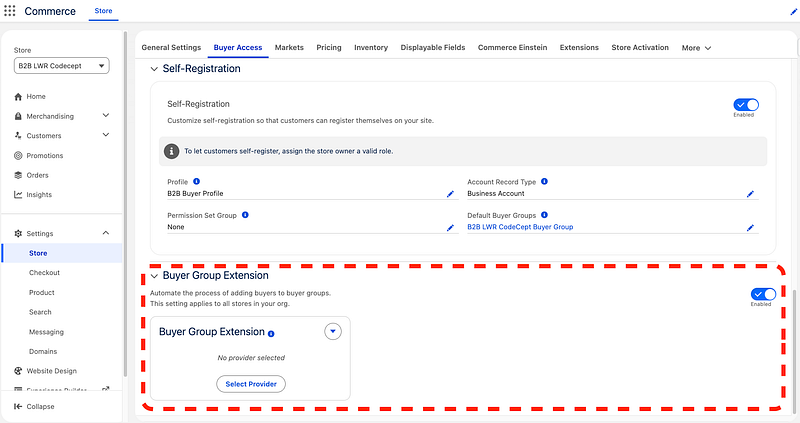
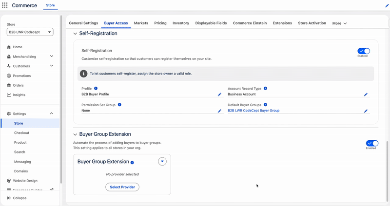
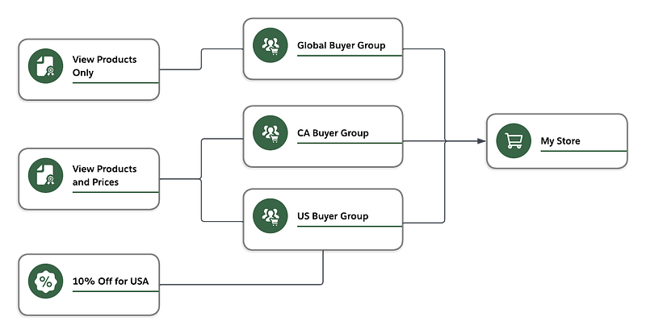
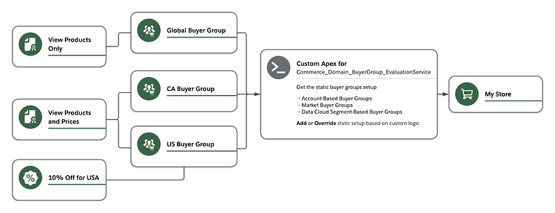
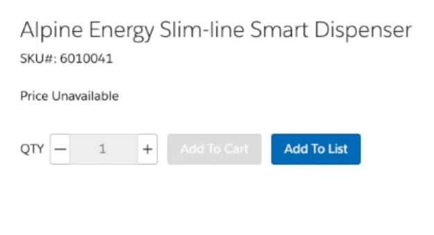
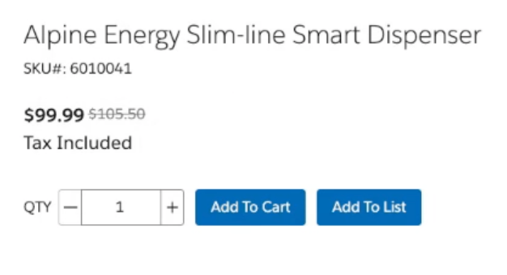
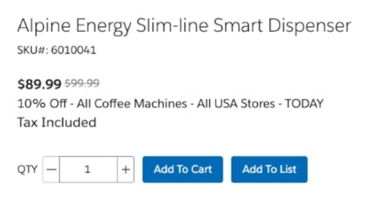
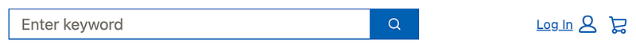

This article details how to implement Buyer Group Extensibility in Salesforce Commerce (Summer '25 Release) to dynamically assign shoppers to buyer groups based on custom Apex logic.

## Context

- Use cases requiring the display of **differentiated** catalogs, promotions or pricing based on **shopper attributes**.
- Displaying **different** catalogs, promotions or pricing dynamically based on **shopper actions**.
- Assign **authenticated** or **guest** users to different Buyer Groups dynamically based on **specific attributes or actions**.

## Notes

- This feature is available for B2B Commerce and D2C Commerce.
- This feature is available as of the Summer '25 Release.
- The Buyer Group Extensibility in the Summer '25 Release includes two features: the first and most important is explained in this article. The second is the ability to assign a Default Buyer Group for Self-Registering Users, which is straightforwardly explained in the [Release Notes](https://help.salesforce.com/s/articleView?id=release-notes.rn_comm_assign_default_buyer_group.htm&release=256&type=5).

## Prerequisites

- Salesforce Mojo — [Demystifying Commerce Cloud Extensions](https://www.youtube.com/watch?v=7rbPajS4iSk)
- Salesforce Release Notes — [Assign Buyers to Buyer Groups by Using Apex Logic](https://help.salesforce.com/s/articleView?id=release-notes.rn_comm_assign_buyer_group_apex.htm&release=256&type=5)
- Developer Guide — [Domain Extension for BuyerGroup](https://developer.salesforce.com/docs/commerce/salesforce-commerce/guide/available-extensions.html#domain-extensions-for-buyer-group)
- GitHub Sample Code — [Sample Buyer Group Evaluation Service class](https://github.com/forcedotcom/commerce-extensibility/blob/main/commerce/domain/buyergroup/service/classes/BuyerGroupEvaluationServiceSample.cls)

## Configuration

- Enable Buyer Group Extension by navigating to Commerce App > Store tab > *Your Store* > Settings > Store > Buyer Access



- Create the Buyer Group Evaluation Service class, this will host the logic for evaluating which buyer groups to assign for the Store user. We will start with an empty class now and fill it gradually in this article. Create an empty class like this:

```apex
public without sharing class BuyerGroupEvaluationServiceSample
  extends commercebuygrp.BuyerGroupEvaluationService {

}
```

- Register the Buyer Group Evaluation Service class either [via Workbench](https://youtu.be/7rbPajS4iSk?t=1150) or conveniently from an anonymous Apex code block like this:

```apex
insert new RegisteredExternalService(
    DeveloperName = 'BuyerGroupEvaluation',
    ExternalServiceProviderId =
        [SELECT Id FROM ApexClass
         WHERE Name = 'BuyerGroupEvaluationServiceSample' LIMIT 1].Id,
    ExternalServiceProviderType = 'Extension',
    ExtensionPointName = 'Commerce_Domain_BuyerGroup_EvaluationService',
    MasterLabel = 'Buyer Group Evaluation'
);
```

- Register the newly created Provider in the Store settings:



- Optional but recommended: create an org cache partition. Go to Setup > Platform Cache > New Platform Cache Partition > Name it "BuyerGroup" for practice purpose.
- Now all authenticated and guest users will be evaluated by the new extension each time they visit or interact with the store ✅

## Use Case

To demonstrate the capabilities of Buyer Group Extensibility, here is a sample setup of a Customer Store selling Coffee Machines Worldwide:



- **Global Buyer Group** will include all users (authenticated and/or guests)-who are not from USA or Canada. These users will be able to see the products available without prices displayed.
- **CA Buyer Group** will include all users in Canada. They will be able to see all products with prices displayed.
- **USA Buyer Group** will include all users in USA. They will be able to see all Products with prices displayed. In addition, they will benefit from a 10% discount on all coffee machines available in USA stores.

To understand why Buyer Group Extensibility matters, let's say that our fictional customer added a new business requirement to identify where the user is based. Instead of relying on the Country attributes on the User/Contact level, the customer wants to identify the country of a specific user using the Country field on the default Contact Point Address record of type Shipping. In a few words, the user's country is determined by the value on their default Shipping address.

This new change is problematic because the Buyer Group setup we did earlier is **static**. If the user changes their default country within the Store, the Buyer Group setup should adapt to that change to show the user the correct products, prices, and promotions. That's why Buyer Group Extensibility provides a mechanism to **dynamically** override the buyer groups eligible for a shopper based on custom logic.

The Extensibility framework will provide an additional layer on top of the static setup to dynamically override the buyer groups based on shopper actions. In our case, one of the actions we're interested in is updating the Country field of the ContactPointAddress record.



## Implementation

Let's implement the custom logic that overrides the Buyer Group setup based on the ContactPointAddress Country. We will explain some key concepts that are essential when designing the Buyer Group Evaluation Service.

The following class is a result of adjustments made to the original Sample [BuyerGroupEvaluationServiceSample](https://github.com/forcedotcom/commerce-extensibility/blob/main/commerce/domain/buyergroup/service/classes/BuyerGroupEvaluationServiceSample.cls) class provided by Salesforce. You can find the full adjusted class [here](/files/blog/sfdefacto-buyer-group-extensibility-commerce/BuyerGroupEvaluationServiceSample.cls).

We will start with implementing the inherited function [commercebuygrp.BuyerGroupResponse getBuyerGroupIds(commercebuygrp.BuyerGroupRequest request)](https://developer.salesforce.com/docs/atlas.en-us.apexref.meta/apexref/apex_class_CommerceBuyGrp_BuyerGroupEvaluationService.htm#apex_CommerceBuyGrp_BuyerGroupEvaluationService_getBuyerGroupIds)

The code below helps identify the user currently accessing the store.

- If it's a guest user, you can identify a unique guest session via the *guest_uuid_essential* Cookie. You can check the explanation and its usage [here](https://developer.salesforce.com/docs/commerce/salesforce-commerce/guide/b2b-b2c-comm-set-up-guest-checkout-headless.html#set-up-guest-authorization-and-cart-tracking-for-headless-commerce-stores). As for our use case, think of the *deviceId* as a unique identifier of a guest user.
- For authenticated users, you can have more information like the *accountId*. Combining that with the available *webstoreId*, you can have a full overview of the user-related records.

```apex
String currentUserId = UserInfo.getUserId(); // Gets the current user ID; could be a logged-in or guest user
String webstoreId = request.getStoreId(); // Gets the webstore record ID
String accountId = request.getAccountId(); // Gets the account ID of the user
String siteId = ((String) [SELECT SiteId FROM WebstoreNetwork WHERE WebstoreId = :webstoreId][0].get('SiteId')).substring(0, 15); // Gets the network site ID
Map<String, Object> requestParameters = request.getRequestContextParameters();
Boolean isGuestUser = (Boolean) requestParameters.get('isGuestUser');
String guestUUIDKey = 'guest_uuid_essential_' + siteId; // Gets the guest UUID cookie key for the current webstore
String deviceId = (String) requestParameters.get(guestUUIDKey); // Gets the guest UUID cookie value for the current user and webstore
```

For authenticated users, let's get the current value of *ContactPointAddress.Country* field.

```apex
String shippingCountryCode;
// If the user is logged in, get the ContactPointAddress.Country
if (!isGuestUser) {
    SObject defaultContactPointAddress = [SELECT Country FROM ContactPointAddress
                                          WHERE AddressType = 'Shipping' AND IsDefault = true AND OwnerId = :currentUserId][0];
    shippingCountryCode = (String) defaultContactPointAddress.get('Country');
}
```

Because of the way the Extension Provider is designed, the custom logic we're building will run each time the user interacts with the store; this means the code will be invoked each time the user or guest reaches the store, clicks a button, navigates to a page, etc. Therefore, it's recommended to rely on a cache system to prevent the code from being re-executed multiple times across the shopper journey.

In our use case, we will rely on the Platform Cache using a dedicated org partition that we will name *BuyerGroup*. We use the *deviceId* (guest) or *currentUserId* (authenticated) to identify data already cached by the custom Buyer Group evaluation class.

```apex
String cachePartition = 'local.BuyerGroup';
Cache.OrgPartition orgPartition = Cache.Org.getPartition(cachePartition); // Gets the buyer group org cache partition

// Cache key must be alphanumeric; converting currentUserId+shippingCountryCode and deviceId to a hashed key
String cacheKey = EncodingUtil.convertToHex(
    Crypto.generateDigest('MD5', Blob.valueOf(isGuestUser ? deviceId : currentUserId + '-' + shippingCountryCode))
);
if (orgPartition.contains(cacheKey)) {
    // Cache hit — return cached buyer groups
    return new commercebuygrp.BuyerGroupResponse((Set<String>) orgPartition.get(cacheKey));
}
```

Next, it's time to get the static Buyer Group configuration. This is essential when you want to append to the existing Buyer Group configuration.

```apex
// Getting default out-of-the-box buyer groups based on existing logic: account, market, and data cloud segment-based buyer groups
commercebuygrp.BuyerGroupResponse defaultBuyerGroupResponse = super.getBuyerGroupIds(request);
Set<String> buyerGroupIds = new Set<String>(defaultBuyerGroupResponse.getBuyerGroupIds());
```

This custom logic is fulfilling the business requirement; for authenticated users, we are looking for Buyer Groups that match the *ContactPointAddress.Country* value. Then, we add those new Buyer Groups to the existing list of statically defined Buyer Groups.

```apex
Set<String> validCountries = new Set<String>();

// If the user is logged in, look for buyer groups that matches the valid countries
if (!isGuestUser) {
    if (shippingCountryCode != null) {
        validCountries.add(shippingCountryCode);
    }
    // In this use case, the Buyer Group names are equivalent to the Country codes
    for (BuyerGroup buyerGroup : [SELECT Id, Name FROM BuyerGroup WHERE Name IN :validCountries]) {
        buyerGroupIds.add(buyerGroup.Id);
    }
}
```

At the end, we're making sure the number of returned Buyer Groups is lower than the limit defined by the constant MAX_BUYER_GROUPS (currently 30). This is a hard limit, meaning the limit will apply even if we don't check it within the code. But it's always better to account for it.

After completing the limit check, we cache the processed list of Buyer Groups to avoid re-running the full code again, then return that list, wrapped by a [commercebuygrp.BuyerGroupResponse](https://developer.salesforce.com/docs/atlas.en-us.apexref.meta/apexref/apex_class_CommerceBuyGrp_BuyerGroupResponse.htm#apex_class_CommerceBuyGrp_BuyerGroupResponse) instance.

```apex
// Buyer group extensibility supports only up to MAX_BUYER_GROUPS buyer groups
if (buyerGroupIds.size() > MAX_BUYER_GROUPS) {
    commercebuygrp.BuyerGroupResponse response = new commercebuygrp.BuyerGroupResponse();
    String errorMessage = 'More than ' + MAX_BUYER_GROUPS + ' buyer groups retrieved for the user. Contact Store Administrator.';
    response.setError(errorMessage, errorMessage);
    return response;
}

orgPartition.put(cacheKey, buyerGroupIds);
return new commercebuygrp.BuyerGroupResponse(buyerGroupIds);
```

## Solution

Once the custom logic is complete, we can interact with the store and compare the different results.

- Product page for guest users and authenticated users outside of the USA and Canada. The product is visible, but the price is not displayed.



- Product page for users in Canada. The product is visible with the price displayed.



- Product page for users in the USA. The product is visible with the price displayed. In addition, a 10% promotion is available.



**The main takeaway from this use case is that product availability, pricing, and promotions dynamically change whenever the user changes the default shipping address.**

**In addition, all Buyer Groups returned by the Extension are usable only at runtime; the static configuration is not altered**.

Keep in mind that the example demonstrated is only one of the use cases unlocked by the Extensibility framework. The sky is the limit…

## Troubleshooting

A tip when working with this feature is to monitor for silent issues. An example is trying to log in as the customer user and noticing that the header does not show the logged-in user (e.g., 'Log In' instead of the username).



Such output is a symptom of the Buyer Group Evaluation Class failing at runtime. To troubleshoot, enable Debug Logs for the customer user and the Automated Process to catch the errors.

Also, there are some considerations to keep in mind when working with Buyer Groups, they are listed in the [Buyer Group Extensibility Considerations](https://help.salesforce.com/s/articleView?id=commerce.comm_buyer_group_extensibility_considerations.htm&type=5).
