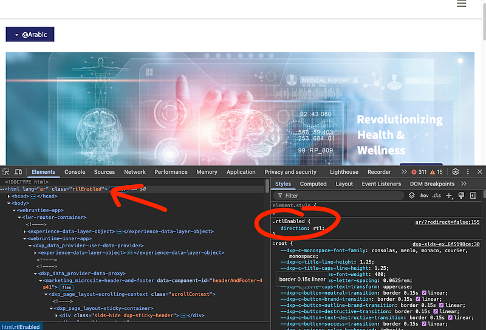
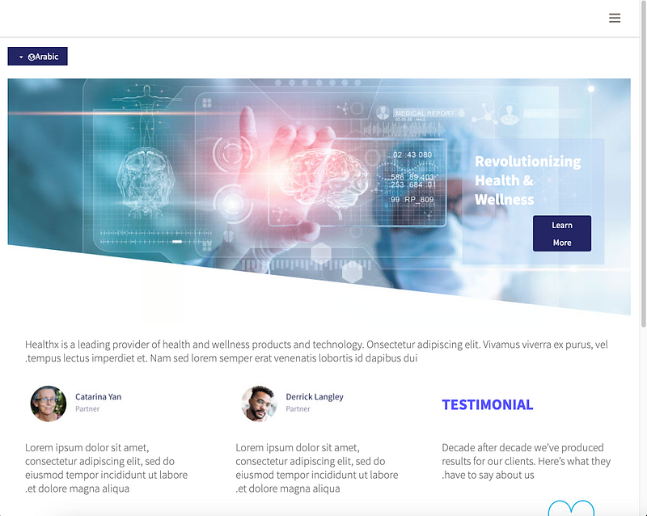
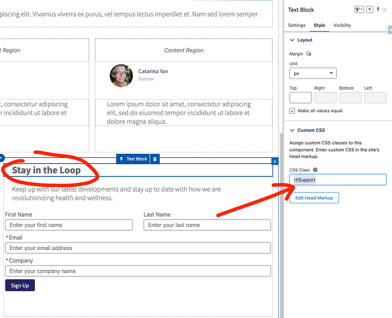
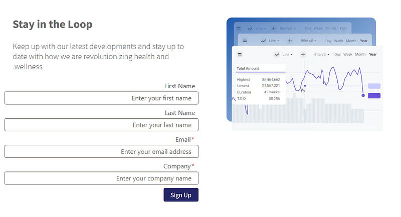
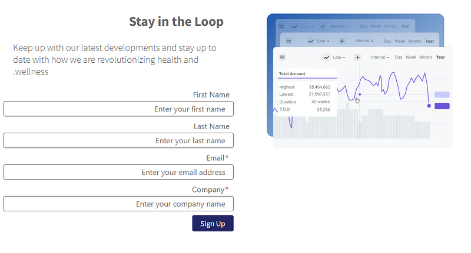

## Context

- You have a requirement to build an LWR Site with support for multiple languages.
- The user will see the site based on their profile's language initially.
- The user will have the ability to switch between site-supported languages.
- The site should be displayed in RTL layout for languages supporting RTL (e.g., Arabic).

Here is some guidance you may follow for RTL with LWR.

## Notes

- RTL is not officially supported in an OOTB fashion.

## Prerequisites

- Check the [Right-to-Left (RTL) Language Support](https://help.salesforce.com/s/articleView?id=xcloud.faq_getstart_rtl.htm&type=5)
- Check the [Add a Language to Your LWR Site](https://developer.salesforce.com/docs/atlas.en-us.exp_cloud_lwr.meta/exp_cloud_lwr/multilingual_lwr_add_language.htm)
- Check the [Automatic Language Detection for Multilingual LWR Sites](https://developer.salesforce.com/docs/atlas.en-us.exp_cloud_lwr.meta/exp_cloud_lwr/multilingual_lwr_automatic_language_detection.htm)

## Implementation Details

The idea is to bind `direction: rtl;` to the html element in your site after rendering.



First thing to do is add the trigger code to the `Head Markup`, this snippet will look for the cookie `PreferredLanguage<siteId>` that's generated when the user changes the default language to an RTL supported language.

> This process will work if the RTL language is not the default language, if the requirement is different, the JS code should be adjusted.

```html
<script type="text/javascript">
    window.addEventListener("load", (event) => {
        console.log("DOM fully loaded and parsed");
        const match = document.cookie.match(new RegExp('(^| )' + 'PreferredLanguage' + '\\S+=([^;]+)'));
        // languages for which flip layout to RTL
        if (match && match[2] === 'ar') {
            const parentElement = document.documentElement;
            parentElement.classList.toggle('rtlEnabled');
        }
   });
</script>
```

Let's analyze this code:

- when the page loads,
- look for the cookie,
- if it's there and has -as value- one of the RTL supported languages,
- toggle on the custom class that's responsible for setting correct RTL styling/tweaking

> Make sure you set the Site security to `Relaxed CSP: Permit Access to Inline Scripts and Allowed Hosts` in order to allow inline scripts to function. No external code is being executed here.

Next, in the head markup, add these styling classes:

```html
<style>
    .rtlEnabled {
        direction: rtl;
    }
</style>
```

**Without RTL Changes**


**With RTL Changes**



## Guidelines for Custom Adjustments on Standard and Custom Components

The previous approach will handle most of the work to display your site in RTL layout. However, some standard or custom components may require additional adjustments. Follow these steps to make component-specific adjustments:

1. Add your adjustments to a new CSS class with a selector that includes the `rtlEnabled` class, for example:

```css
.rtlEnabled .rtlSupport {
   justify-items: right; /* additional adjustments */
}
```

2. Bind this CSS class to the standard or custom component using the Style tab in Experience Builder as shown below:



3. Publish your changes

You can see the effect of these adjustments in the screenshots below (compare the alignment of the text `Stay in the Loop`):

**RTL + No Adjustments**



**RTL + Additional Adjustments**



**How this works:** The additional styling (via `rtlSupport`) will only be applied when the `rtlEnabled` class is bound to the main container, which is controlled by the JavaScript code in the first section.

## Important Considerations

- The entire content should be translated to provide a complete RTL language experience. Translation Workbench will be essential for this task.
- While this approach handles approximately 90% of the RTL layout requirements, you may need to manually adjust about 10% of the styling at the component level using the technique described above.
